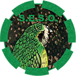

    

# Hohenstaufen Waffen-SS Units
This repository contains the source code used to create the Hohenstaufen Waffen-SS Units mod available on the [Steam Workshop](https://steamcommunity.com/sharedfiles/filedetails/?id=2442839928). The rest of the README is identical to the Steam Workshop's description.
___
This mod is a kit-bash of the uniforms from Hohenstaufen Re-Tex Pack and Faces of War. The units are placed in the faction "Hohenstaufen Waffen SS" and split into sub-categories. Every sub-category is divided by their uniforms and camouflage. The following sub-categories are available: M42 Oak Leaf Autumn, M42 Oak Leaf Summer, M42 Plane Tree Autumn, M42 Plane Tree Summer, M43 Field Grey, and M44 Pea Dot.

Every sub-category contains the following units:

* Panzergrenadier (Kar-98k)
* Panzergrenadier (MP-40)
* Panzergrenadier (G43)
* Sniper (Scoped Kar-98k)
* Spotter
* Radio Operator
* Medic
* Machine Gunner (MG-42)
* Assistant Gunner (MG-42 Drums)
* Assistant Gunner (MG-38 Barrel)
* Storm Trooper (MP-40)
* Squad Leader (MP-40)
* Squad Leader (STG-44)

Additional units are available under M44 Pea Dot.

* Second Lieutenant (MP-40)
* Second Lieutenant (STG-44)

If you have additional ideas for more units using the Hohenstaufen Re-Tex Pack and Faces of War, feel free to suggest it in the comments.

# Bugs
Please post bugs in the [Steam Workshop's comment section](https://steamcommunity.com/sharedfiles/filedetails/?id=2442839928) or the [GitHub repository's issues section](https://github.com/Uncle-Sagbag/hohenstaufen_units/issues).

# License
This mod inherits the license from Faces of War. As far as I know, their license is at follows:

> We do not allow:
> - Any edit to our files without permissions
> - Any re-upload on Steam workshop
> - Any commercial use (monetized servers included)

As a result, this mod follows the same license.